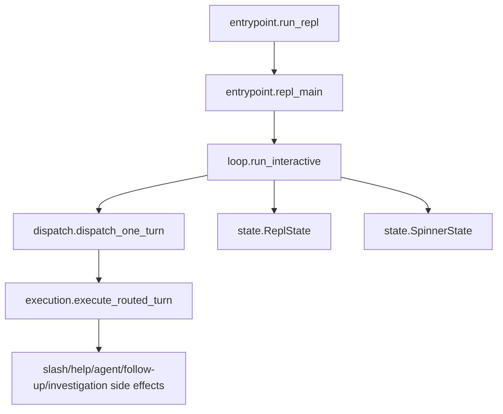

# Runtime package rules

## Human summary

The `runtime` package is the interactive shell runtime for OpenSRE. It keeps
the prompt alive, accepts user input turn by turn, routes each turn to the
right handler, executes actions, and keeps the terminal responsive while work
is running.

In simple terms:

- `entrypoint.py` starts the interactive session and handles startup/shutdown.
- `loop.py` runs the async prompt loop, queue, and cancellation wiring.
- `dispatch.py` is the control-plane router for one turn: it decides **how** a
  turn should be handled (slash command vs agent/help/follow-up path), handles
  cancel/confirm gating, and delegates execution.
- `execution.py` performs the side effects (run slash commands, answer via
  agent/help/follow-up, run investigations, emit analytics).
- `state.py` holds shared runtime state (`ReplState`, `SpinnerState`) used by
  the loop and dispatch flow.
- `session.py` owns the per-REPL-process `ReplSession` (history, accumulated
  context, trust mode, interaction counters).
- `tasks.py` owns the cross-session task registry surfaced via `/tasks` and
  `/cancel`.

These instructions apply to `app/cli/interactive_shell/runtime/` and all
subdirectories. Parent `AGENTS.md` files still apply.

## Architectural intent (locked)

The runtime package is intentionally split into focused concerns:

- `state.py` — runtime state and transition helpers only.
- `dispatch.py` — control-plane routing/input gating only.
- `execution.py` — side-effectful execution only.
- `loop.py` — async prompt runtime/event loop orchestration only.
- `entrypoint.py` — process/bootstrap boundary only.
- `session.py` — session-scoped REPL state only.
- `tasks.py` — task registry + persistence only.

Keep these boundaries strict. If a change crosses concerns, move code to the
owner module instead of broadening module responsibilities.

## Data flow contract (locked)

The interactive runtime must keep this shape:

1. `entrypoint.run_repl` sets up process-level concerns and calls `repl_main`.
2. `loop.run_interactive` owns queueing, prompt lifecycle, and task scheduling.
3. `dispatch.dispatch_one_turn` computes control decisions and delegates.
4. `execution.execute_routed_turn` performs side effects.

Do not invert this dependency direction.

### Architecture diagram

## State ownership rules

- `ReplState` is the single source of truth for:
  - active dispatch task
  - cancellation event
  - confirmation event/response lifecycle
  - exit requests
- Use `ReplState` helpers (`start_dispatch`, `finish_dispatch`,
  `begin_confirmation`, `clear_confirmation`, `cancel_current_dispatch`) rather
  than direct field mutation where possible.
- `SpinnerState` owns spinner rendering state only; it must not depend on
  runtime task management.

## Dispatch rules

- `dispatch.py` must remain control-plane only:
  - route input
  - correction/cancel/confirm gating
  - command normalization for slash decisions
  - delegation to execution
- Do not add analytics emission, LLM calls, investigation execution, or slash
  side effects to `dispatch.py`.

## Execution rules

- `execution.py` owns all side effects:
  - slash command dispatch
  - cli help/agent/follow-up responses
  - investigation launch and error handling
  - route decision analytics emission
- `execute_routed_turn` must receive a `RouteDecision` from dispatch/runtime;
  execution should not re-route user input.

## Loop rules

- `loop.py` owns:
  - prompt-toolkit wiring
  - queue processor
  - dispatch task lifecycle
  - alert watcher lifecycle
  - cancellation and confirmation wiring through `ReplState`
- Keep prompt rendering concerns in runtime/prompting modules, not in
  dispatch/execution.

## Entry-point rules

- `entrypoint.py` owns:
  - startup sweep
  - TTY/non-TTY gate
  - banner display for interactive runs
  - alert listener setup/teardown
  - async boundary (`asyncio.run`)
- Do not move per-turn dispatch/runtime logic back into entrypoint.

## Compatibility surface policy

- `runtime/__init__.py` should be a thin export layer.
- Do not duplicate business logic in `__init__.py`.
- Do not re-add `_xxx` underscore aliases or wrapper functions for
  compatibility. Tests and callers should import canonical names from their
  owning submodule.

## Test seam policy

- Prefer patching canonical module seams:
  - `runtime.dispatch.*` for control-plane behavior
  - `runtime.execution.*` for side effects
  - `runtime.entrypoint.*` for process/bootstrap behavior
  - `runtime.state.*` for state-specific behavior
  - `runtime.loop.*` for prompt-loop / streaming console behavior
- Avoid adding new tests that monkeypatch package-root internals in
  `runtime.__init__` unless there is no stable canonical seam.

## Refactor guardrails

- No behavior changes to routing policy should be introduced from
  `runtime/` refactors.
- Keep interruption semantics unchanged:
  - Esc or bare cancel commands interrupt active dispatch
  - confirmation prompts are cancel-safe and never silently auto-confirm
- Preserve observability semantics (route decision capture, turn summaries).
